# jni

java native interface:java本地开发接口。它实际就是java和c之前调用的一种协议，他可以让java调用c++或者c代码，也可以反过来进行调用。

## 为什么需要使用jni

- 通过jni技术，可以扩展android手机的功能
- 执行效率高
- 代码复用

## 如何使用

- 学c语言，看懂代码
- jdk

## c语言

调用系统函数

```c
system("calc");
system("mspaint");
system("pause");
```


## 第一个c代码

```c
#include<stdio.h>
#include<stdlib.h>
int main(){
	system("pause");
	return 0;
} 
```

常见的数据类型

```c
char  int float double long short signed unsigned void 
计算类型的大小
sizeof("类型");就会返回一个int的一个长度。
占位符 %d
```

java和c的区别

- char在java中长度是两个字节  c是1个字节
- longjava中是8个字节  c中是4个
- c中没有byte，没有bool
- siged:有符号 ： -128 ~ 127
- unsigned：无符号 0~255
- void无类型

 ## 输入输出


```c
int main(){
	int s;
	//输入函数 
	scanf("%d",&s);
	
	//输出打印数组
	char charArray[] = {'H','E','L','L','O'};
	int j ; 
	for(j=0;j<5;j++){
		printf("chararray[%d] == %c\n",j,charArray[j]);
	}

	//c是没有字符串在，但是可以使用数组表示 
	//输出字符串
	printf("%s",charArray); 
	system("pause");
	return 0;
} 
```


## 指针

指针就是内存地址


## 交换两个数字的值


这种传值是无法改变值的。因为他们两个的地址都是不相同的。‘

我们传入地址


## 多级指针

代码定义多级指针

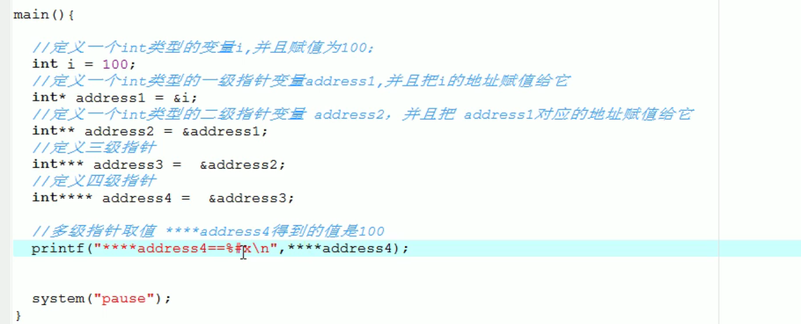

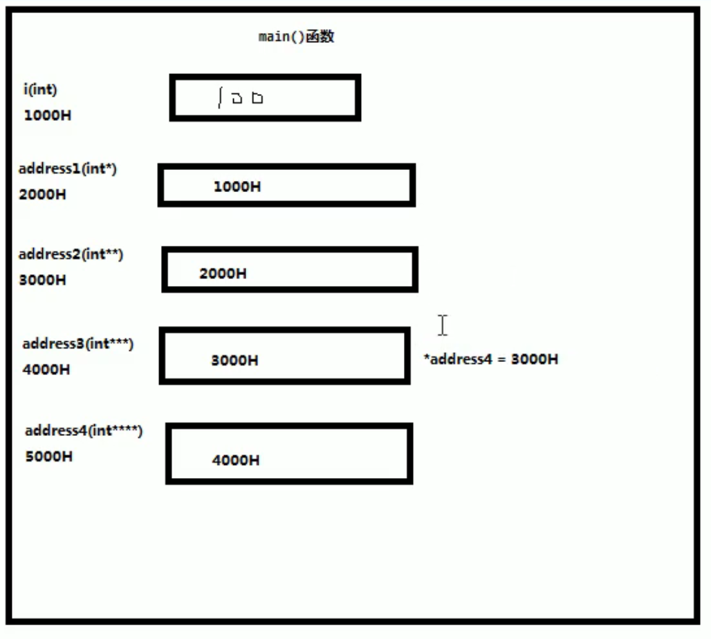 

## 数组

数组的取值，数组取地址  数组是一块连续的地址  数组的设计

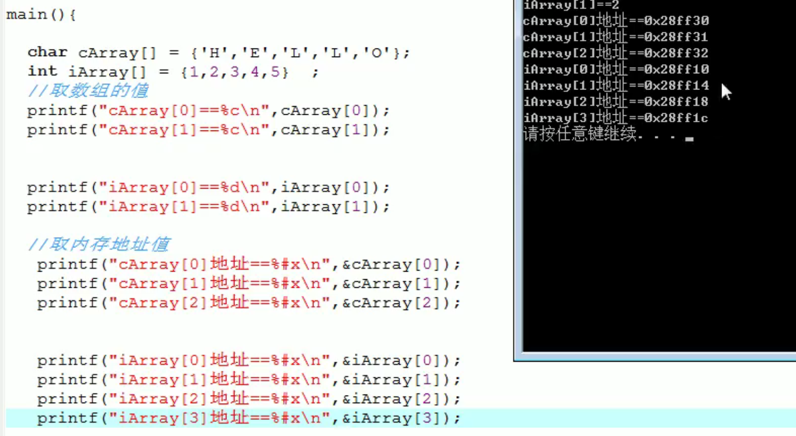

指针取值

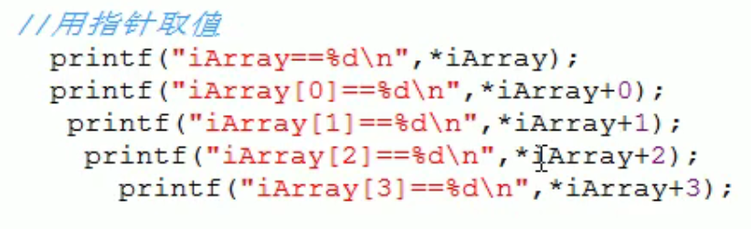

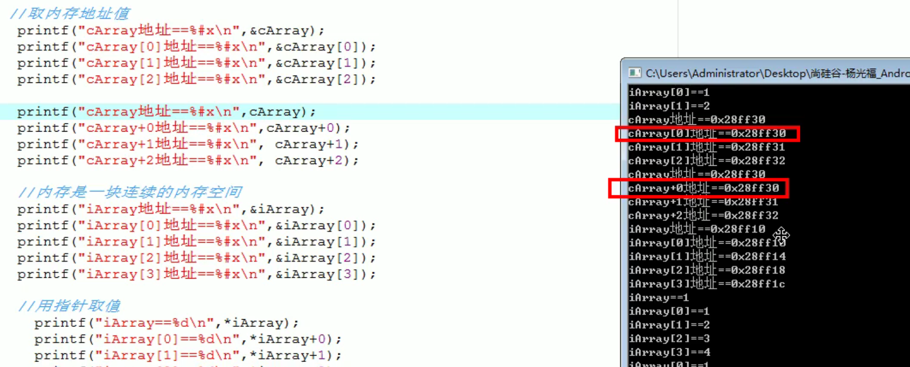 

## 静态内存分配

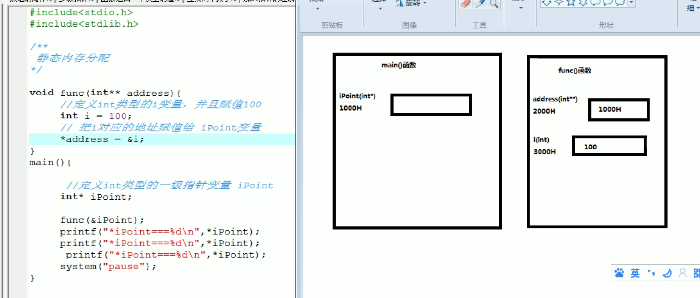

静态内存分配在不经意间就会被回收掉，他是又系统控制的。

## 动态内存分配

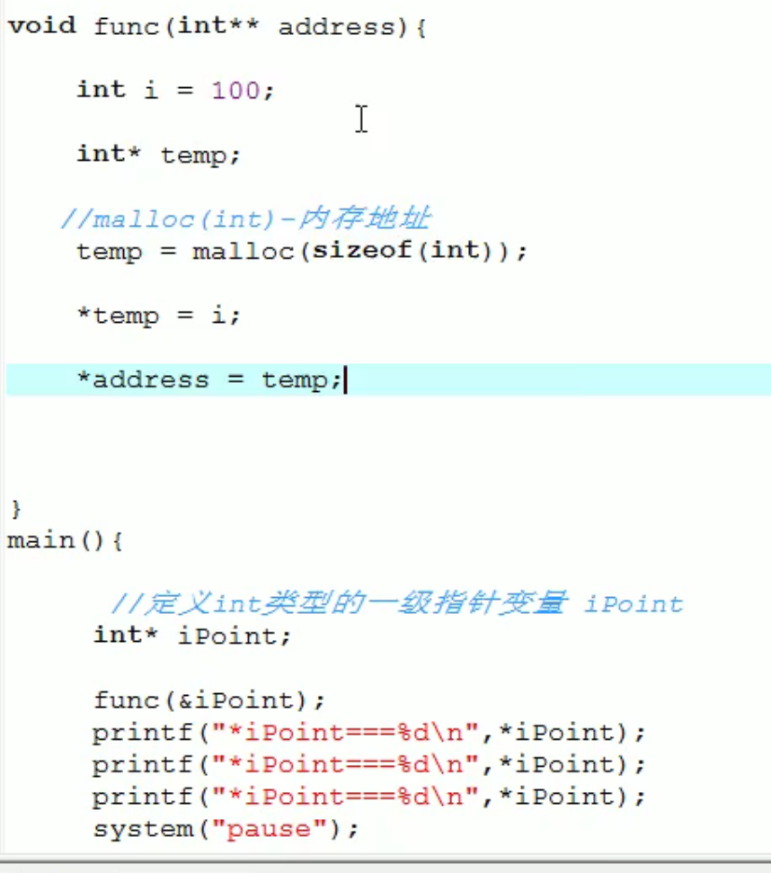

动态内存地址需要手动的进行删除掉。

## 动态数组

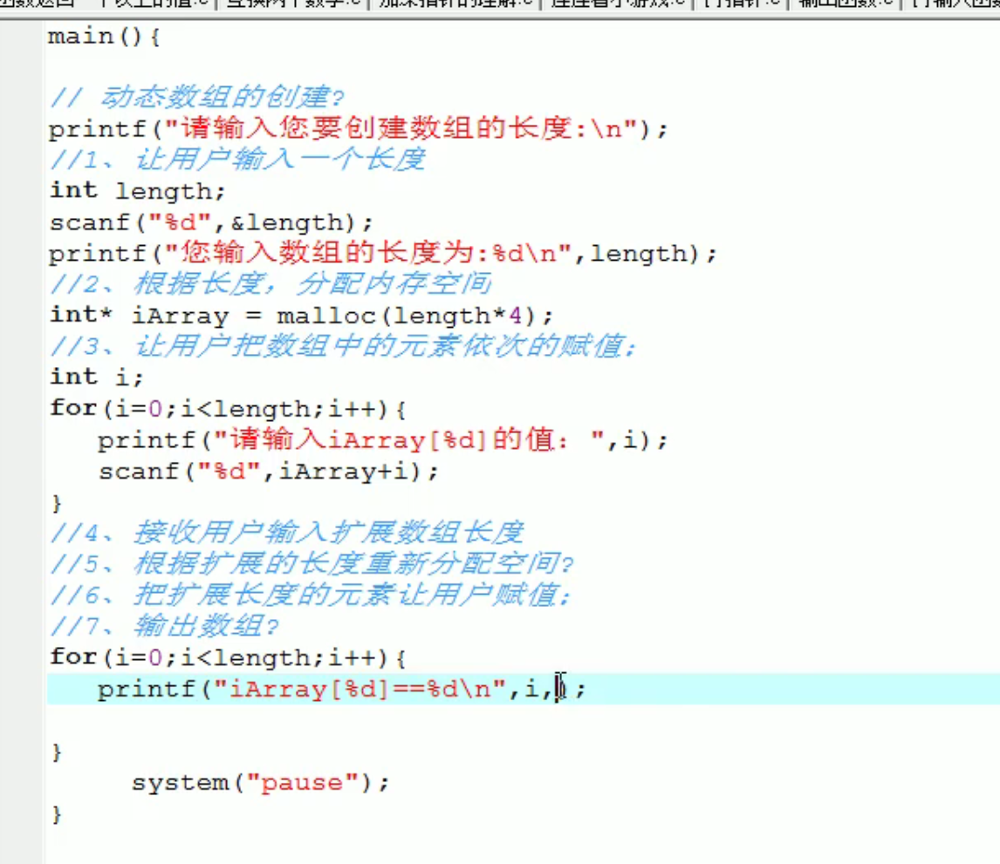

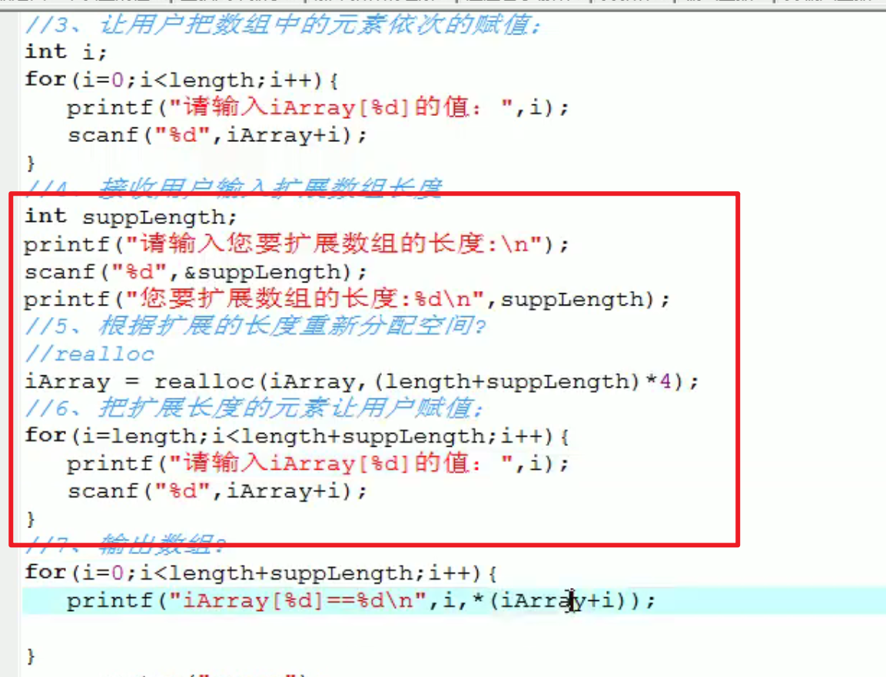## 指针函数

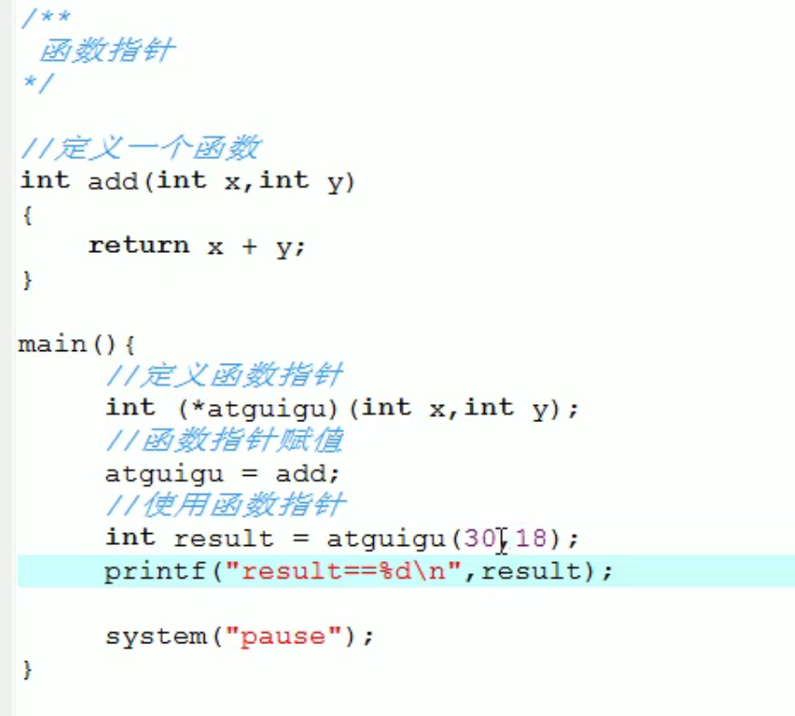

## 联合体

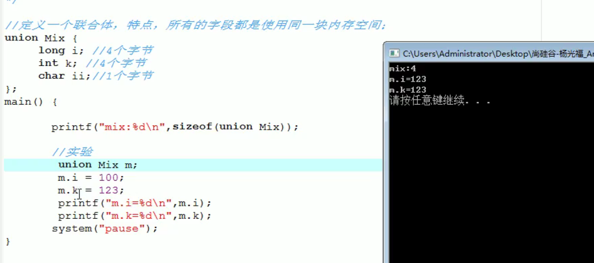

## 枚举

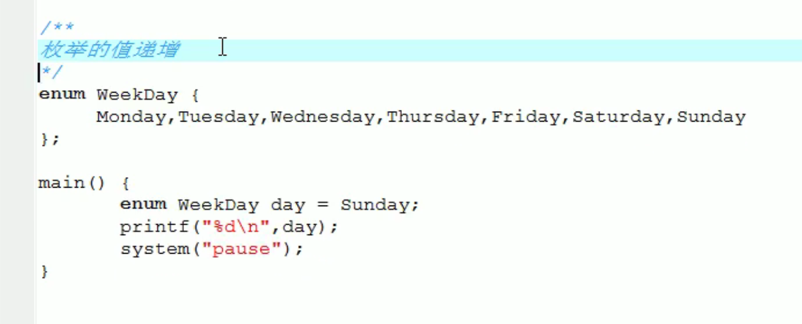

## 别名

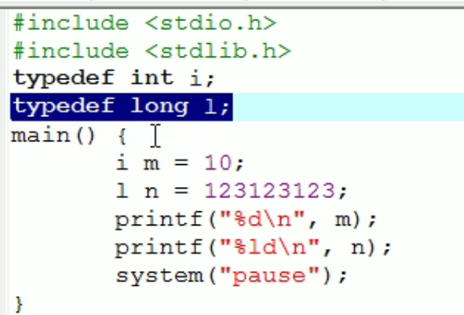 

## 结构体


### 结构体指针

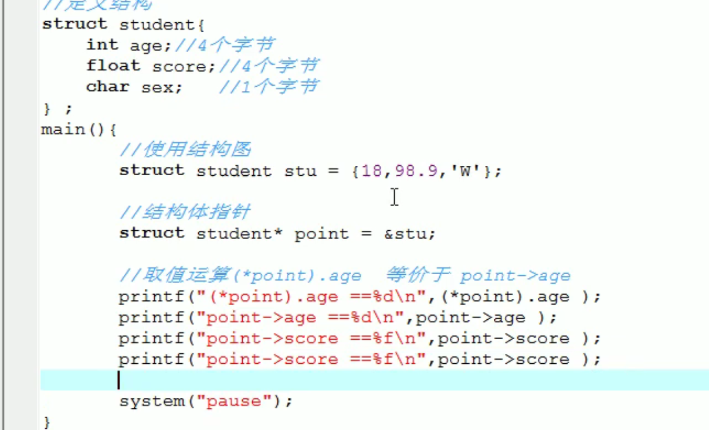

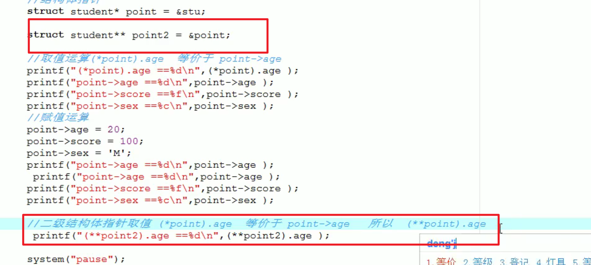

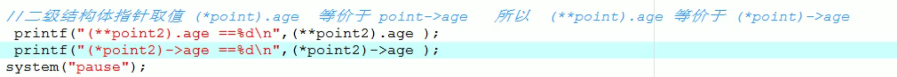