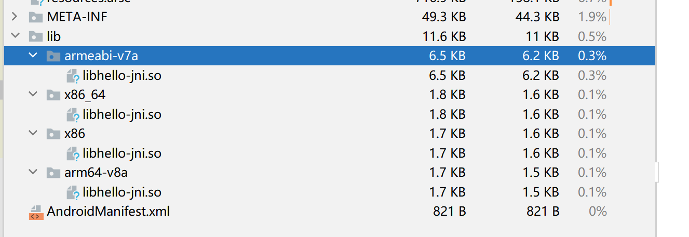

# 创建第一个JNI程序

1.创建一个android项目

2.添加JNI支持	

- 首先在Android下的build添加

```java
//编译出来的平台   
ndk {
    abiFilters "arm64-v8a", "armeabi-v7a"
        //abiFilters "armeabi-v7a"
        支持的类型 abiFilters "arm64-v8a", "armeabi-v7a","x86", "x86_64"
}
```



- 添加配置文件地址

```java
externalNativeBuild {
    cmake {
        指定位置
        path "src/main/cpp/CMakeLists.txt"
    }
}
```

- CMAKE文件

```java
#指明cmake的版本
cmake_minimum_required(VERSION 3.4.1)
//我们分享库的名字
add_library(
#        最总生成的so的名字
#        SHARED   STATIC:  动态  静态库
        hello-jni
        SHARED
        hello-jni.cpp)
#连接哪些资源
# Include libraries needed for hello-jni lib
target_link_libraries(hello-jni
                      android
                      log)
```

3.java代码

```java
加载lib库
static {
    System.loadLibrary("hello-jni");
}   
native String showString();
```

4.jni代码

```java
extern "C"
JNIEXPORT jstring JNICALL
Java_com_example_demo_MainActivity_showString(JNIEnv *env, jobject thiz) {
	//得到jstring
    return env->NewStringUTF("Hello-jni");
}
```

## 看一下JNIEnv
它是一个结构体
```C++
typedef _JNIEnv JNIEnv;
struct _JNIEnv;	

struct _JNIEnv {
    /* do not rename this; it does not seem to be entirely opaque */
    const struct JNINativeInterface* functions;
#if defined(__cplusplus)
    jint GetVersion()
    和一些方法
   
```

## jobject
```java
typedef _jobject*       jobject;
```

