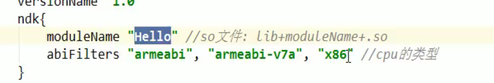

# 创建步骤


gradle.properties添加

兼容老版本


在main下创建一个jni目录 ，创建一个hello。




指定生成.so的文件名称。第二个参数指定生成的平台，默认会生成所有的平台

编译的版本

```
//    externalNativeBuild {
//        cmake {
//            path "src/main/cpp/CMakeLists.txt"
//            version "3.10.2"
//        }
//    }
```


## 加载库

加载自己编写的库

```c++

    // Used to load the 'native-lib' library on application startup.
    static {
        System.loadLibrary("Demo");
    }
```

显示jni中的字符串


